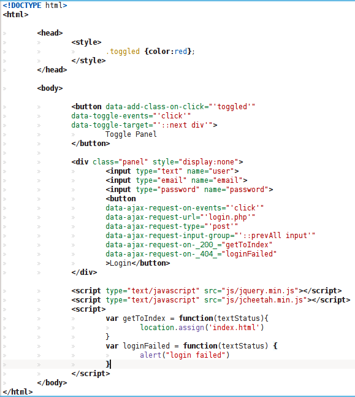

# jCheetah

jCheetah is a jQuery plugin that allows you to use custom HTML attributes to perform certain actions described by modules, it's extensible so as to allow you to write your own.

It's primary objective is to increase readibility and reduce javascript, which also could impact develop times.

Also includes client side templating (module ajax) and a mysql udf to get data directly in JSON/CSV format (not required by jCheetah itself but optional), which objective is to create JSON/CSV models which will then be parsed by the ajax module.

jCheetah is developed and mantained by [Edward González](mailto:eg@onzasystems.com), tips/advices are welcome.

__General Example__

__Required__:

[jQuery](http://jquery.com/) some modules require [jQuery ui](http://jqueryui.com)

## Building jcheetah

	python3 generate.py build
	python3 generate.py build-docs

**Note:** jCheetah documentation requires from jCheetah itself, you can run it from your hard drive using firefox.

## Directories

`base`: Code for the base/core.

`default`: Contains the data to be added at the end of the file.

`docs`: Contains the documentation.

`modules`: The modules that are used when generating the jcheetah file.

`mysql`: The mysql udf.

## Modules

__Ajax Events__: Handles Ajax Events using the Ajax Module.

__Ajax Request Events__: Send ajax request according to an event.

__Ajax__: Loads HTML/JSON/CSV/XML data in the DOM, supports client side templating.

__Animation Events__: Animates using $.animate.

__Autocomplete__: Generate jQuery ui autocomplete widgets.

__Class Events__: Switch (change) classes according to an event.

__Dialog Events__: Manage jQuery ui Dialogs.

__Dialog__: Generate jQuery ui dialog widgets.

__Form Validate Activation__: Just activates formValidation.

__Input__: Takes input from the user, by default only contains spinner and datepicker ui widgets.

__JCEvents__: jCheetah events using $.bind, runs a function (performs an action) according to an event.

__Toggle Events__: Toggle DOM elements.
